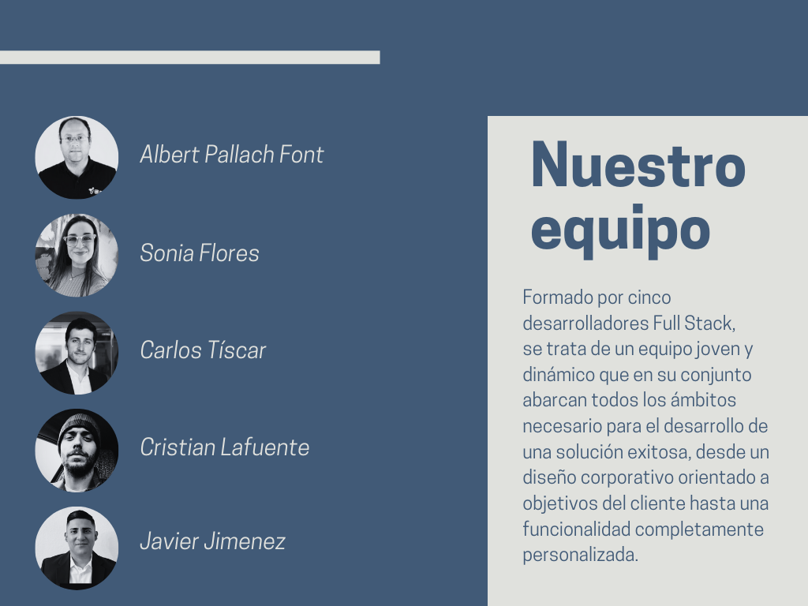

# 🚀 IDFASHION - E-COMMERCE

El objetivo del proyecto es la creación de una aplicación web para la gestióncompleta de un sitio orientado a la compra-venta de productos de moda. Se debecentrar el desarrollo tanto en la parte del usuario que se acerca al contenido para realizar sus compras, como en la parte del gestor que se encarga de definir y
maquetar todo el contenido de los productos a mostrar.
Por lo tanto dispondremos de dos tipos de usuarios: administrador y cliente.El usuario administrador debe estar registrado en la aplicación por defecto y tiene todos los permisos necesarios para acceder al dashboard interno de la aplicación donde podrá gestionar todos los datos relativos a los diferentes productos.
Es el encargado de crear categorías, subir y definir productos y colocarlosdependiendo de aquellos que quiera destacar dependiendo de ofertas, épocas del año destacadas o campaña de promoción.
El cliente debe poder consultar cualquier aspecto relacionado con los productos publicados en la aplicación, así como navegar sin problema por cualquiera de las partes públicas del sitio.
Para poder comprar, editar su carrito de la compra, marcar como favorito o crear algún tipo de reseña debe registrarse y autenticarse.
El proceso de compra puede simularse o quedarse en el paso previo al cobro, no hace falta implementar ningún tipo de pasarela de pago o similar.

Info aplicación: [IDProject](IDProject.pdf)

## 🎯 Requisitos mínimos

- Sistema de autenticación con dos perfiles: administrador y cliente.

- El administrador debe poder realizar las siguientes tareas:
  - Creación y edición de categorías.
  - Creación y edición de los productos en las diferentes categorías.

E-Commerce:

- Establecimiento de la posición de los diferentes productos en función deofertas o días especiales.

- Visualización de procesos de compra por parte de los clientes.

- El usuario cliente dispone de las acciones:
  - Puede revisar la parte pública sin necesidad de acceder al sistema.
  - Puede marcar ciertos artículos como favoritos para hacerles un seguimiento.
  - Dispone de un espacio de tipo “carrito de la compra” donde puede situar los productos a comprar.
  - Puede escribir reseñas sobre un producto o recomendar las reseñas de otros clientes.

## 💫 Deseables

- Sistema de seguimiento por email para avisar al cliente cuando uno de los artículos marcado como favorito modifica su precio.

## 🛠️ Requisitos técnicos

- Framework de FrontEnd:  
  

- Base de datos, dependiendo las necesidades del proyecto, podrá ser elegida entre  
   

- Backend la aplicación la realizaremos en  
   

## 🔗 Tecnologías

### 🖼️ Front End

[](https://angular.io/)
[](https://getbootstrap.com/)

### 💽 Back End

[](https://angular.io/)
[](https://getbootstrap.com/)
[](https://getbootstrap.com/)

## 💻 Ejecuta el respositorio localmente

[](https://git-scm.com/) [](https://www.npmjs.com/)

Clona el proyecto

```bash
  git clone https://github.com/Pallacus/IDFashion_front.git
```

Accede al directorio del proyecto

```bash
  cd front
```

Instala las dependencias

```bash
  npm install

```

```bash
  git clone https://github.com/Pallacus/IDFashion_back.git
```

Accede al directorio del proyecto

```bash
  cd back
```

Instala las dependencias

```bash
  npm install

```

## FRONT:

Inicia el servidor en el Front:

```bash
  ng s
```

## BACK:

Debes tener instalado el backend:

```bash
  npm run dev
```

## Ayuda creación .env

```
DB_HOST="127.0.0.1"
DB_USER="nombre_MySQL_User"
DB_PASSWORD="password"
DB_PORT=numero_puerto
DB_NAME="db_name"
SECRET_KEY="SeCrEt"

```

Inicia el servidor en el Back:

```bash
  npm run dev

```

;

## ✍🏼 Autores ©️

- [@CristianLafuente](https://github.com/CristianLafu)
- [@SoniaFlores](https://github.com/Sonia-Flores)
- [@Carlos Tíscar](https://github.com/cativi)
- [@Javier Jimenez](https://github.com/albegosu)
- [@Albert Pallach](https://github.com/Pallacus)
